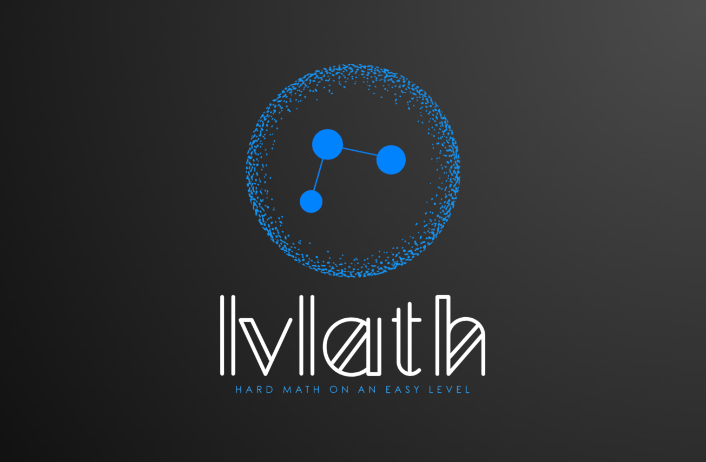

---
# lvlath

[](https://pkg.go.dev/github.com/katalvlaran/lvlath)
[](https://goreportcard.com/report/github.com/katalvlaran/lvlath)
[](https://golang.org)
[](LICENSE)
[](https://github.com/katalvlaran/lvlath/actions)

---

## What is lvlath & Why use it?

> **lvlath** is a lightweight, thread-safe, and extensible Go library for working with graphs. It offers:

* **Core graph primitives**: vertices, edges, mutators (add/remove), and intuitive API.
* **Matrix representations**: adjacency and incidence matrices with converters.
* **Classic algorithms**: BFS, DFS, Dijkstra, Prim, and Kruskal — all with hookable callbacks.
* **Safety & simplicity**: minimal dependencies, clear naming, and built-in concurrency protection.

Use lvlath to build network analysis tools, game maps, dependency solvers, or educational demos — quickly and confidently.

---

## Installation

```bash
go get github.com/katalvlaran/lvlath@latest
```

## 🗂️ Package Structure

```
lvlath/
├── graph/
│   ├── core/         # Graph, Vertex, Edge, concurrent-safe primitives
│   ├── matrix/       # AdjacencyMatrix, IncidenceMatrix, converters
│   └── algorithms/   # BFS, DFS, Dijkstra, Prim & Kruskal, etc.
├── go.mod
├── LICENSE
└── README.md         # This file
```
---

## Quick Start

```go
package main

import (
  "fmt"

  "github.com/katalvlaran/lvlath/graph/core"
  "github.com/katalvlaran/lvlath/graph/algorithms"
)

func main() {
  // 1) Build an undirected, unweighted graph (a simple chain)
  g1 := core.NewGraph(false, false)
  g1.AddEdge("A", "B", 0)
  g1.AddEdge("B", "C", 0)
  fmt.Print("BFS from A in g1: ")
  if res, err := algorithms.BFS(g1, "A", nil); err == nil {
    for _, v := range res.Order {
      fmt.Print(v.ID, " ")
    }
  }
  fmt.Println()

  // 2) Build a directed, weighted graph
  //    A→B(4), A→C(2), C→B(1), B→D(5)
  g2 := core.NewGraph(true, true)
  g2.AddEdge("A", "B", 4)
  g2.AddEdge("A", "C", 2)
  g2.AddEdge("C", "B", 1)
  g2.AddEdge("B", "D", 5)
  dist, parent, _ := algorithms.Dijkstra(g2, "A")
  fmt.Printf("Shortest path A→D: dist=%d via %s\n", dist["D"], parent["D"])
}

```

[Run on Go Playground](https://go.dev/play/p/5xUeDTDfSHF)

---

## 🚀 Features

* **Core Graph** (`graph/core`)

  * Thread-safe adjacency-list implementation
  * Directed & undirected, weighted & unweighted support
  * Clone, clone-empty, multiedges, self-loops
* **Matrix Representations** (`graph/matrix`)

  * Adjacency matrix with O(1) edge lookup
  * Incidence matrix for algebraic operations
  * Converters: `ToMatrix`, `ToEdgeList`
* **Algorithms** (`graph/algorithms`)

  * **BFS**: breadth-first search with hooks & cancellation
  * **DFS**: depth-first search with pre- and post-visit hooks
  * **Dijkstra**: shortest paths in weighted graphs
  * **Prim & Kruskal**: minimum spanning tree algorithms
  * **Other Populars**: already in development and coming soon

## Feature Matrix

| Package     | Core Graph      | Matrices                   | Algorithms          |
| ----------- | --------------- | -------------------------- | ------------------- |
| Functions   | AddVertex/Edge… | ToMatrix, AdjacencyMatrix… | BFS, DFS, Dijkstra… |
| Thread-safe | ✔               | n/a                        | n/a                 |
| Weighted    | ✔               | ✔                          | ✔                   |

---

## Examples

See [GoDoc Examples](https://pkg.go.dev/github.com/katalvlaran/lvlath#section-examples) for:

* **Core**: basic graph creation, add/remove vertices & edges.
* **Matrix**: adjacency/incidence matrix conversion.
* **Algorithms**: BFS, DFS, Dijkstra, Prim, Kruskal — each with usage examples.

---

## Roadmap

* Parallel/concurrent algorithm variants
* A\* shortest path
* Graph serialization (JSON/GraphML)
* Full coverage of almost all the most popular and needed algorithms, like:

| Category                  | Algorithms                                                                                      |
| ------------------------- | ----------------------------------------------------------------------------------------------- |
| **Graph Traversal**       | BFS, DFS                                                                                        |
| **Shortest Paths**        | Dijkstra                                                                                        |
| **Minimum Spanning Tree** | Prim, Kruskal                                                                                   |
| **Flow & Cuts**           | (future) Ford–Fulkerson, Edmonds–Karp, Dinic                                                    |
| **Traveling Salesman**    | (future) exact & approximation (Held–Karp, Christofides)                                        |
| **Time Series / DTW**     | (future) Dynamic Time Warping for sequence alignment                                            |
| **Stochastic Models**     | (future) Geometric Brownian Motion samplers, Hidden Markov Models for probabilistic state paths |
| **More to come…**         | A\*, bidirectional search, hypergraph support, parallel traversal                               |


---

## FAQ

*Nothing here yet! If you have questions, [open an issue](https://github.com/katalvlaran/lvlath/issues).*

---

## Support & Contacts

For bugs, feature requests, or general inquiries:

* GitHub: [katalvlaran/lvlath](https://github.com/katalvlaran/lvlath)
* Email: [katalvlaran@gmail.com](mailto:katalvlaran@gmail.com)

---

*© 2025 katalvlaran — MIT License*

---

*Happy graphing!*
