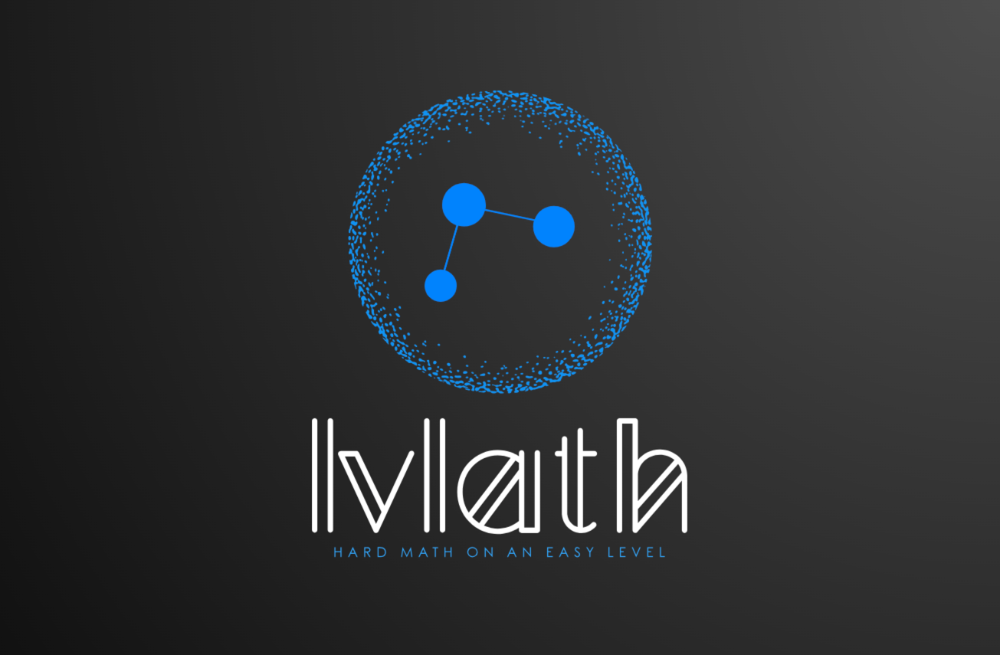

<!--
  SPDX-License-Identifier: AGPL-3.0-only
  Copyright (C) 2025-2026 katalvlaran

  lvlath - Repository README

  Purpose:
    This README is the public face of lvlath. It presents the library as a
    deterministic, contract-driven Go toolkit for graph algorithms, flow networks,
    dense graph algebra, routing, time-series alignment, and reproducible
    algorithm engineering. It should give a new reader immediate confidence in
    what lvlath can solve, how packages compose, where the formal contracts live,
    and why this repository is engineered beyond ad-hoc algorithm snippets.

  License:
    lvlath is licensed under AGPL-3.0-only. See LICENSE.
-->



---

```text
┌─────────────────────────────────┐
│  o       o            o    o    │
│  ║ o   o ║   o───╖  o─╫─o  ║    │
│  ║  \ /  ║   o───╢    ║    ╟──╖ │
│  ╙o  o   ╙o  ╙───o    ╙o   o  o │
└─────────────────────────────────┘
```

[](https://pkg.go.dev/github.com/katalvlaran/lvlath)
[](https://goreportcard.com/report/github.com/katalvlaran/lvlath)
[](https://golang.org)
[](LICENSE)
[](https://github.com/katalvlaran/lvlath/actions)

---

# lvlath

**lvlath** is a pure-Go algorithm engineering library for graphs, flows, dense graph algebra, routing, time-series alignment, and reproducible test fixtures.

It is built for people who need algorithmic tools they can explain in a code review, trust in CI, compose across packages, and debug from deterministic artifacts instead of guessing why an answer changed.

**The core promise:**

> Same graph, same options, same algorithm - same result surface, same witness semantics, same failure class.

`lvlath` is not just “BFS, DFS, Dijkstra, and friends.” It is a small ecosystem where:

* `core.Graph` gives deterministic, thread-safe topology with explicit capabilities;
* traversal packages publish meaningful result artifacts, not incidental internal state;
* weighted routing keeps `+Inf`, unknown targets, disabled path tracking, and unreachable targets separate;
* `matrix` turns topology into dense numeric objects without erasing zero-weight or metric-closure semantics;
* flow, MST, TSP, DTW, grid, and builder packages extend the same discipline into optimization, alignment, fixtures, and examples.

---

## Why lvlath exists

A graph library becomes dangerous when the simplest demo works but the real system loses determinism, topology meaning, or error identity.

The common failures are familiar:

* Go map iteration leaks into traversal order;
* directed, undirected, mixed, loop, and multi-edge semantics are assumed instead of modeled;
* zero-weight edges disappear inside adjacency matrices;
* `+Inf` is flattened into magic integers or arbitrary large constants;
* BFS is accidentally used for weighted routing;
* Dijkstra silently accepts invalid negative weights;
* DFS finish order is confused with discovery order;
* max-flow examples show a number but hide residual capacity semantics;
* examples panic or print unstable maps;
* documentation explains theory but not actual API contracts.

`lvlath` answers those problems with explicit engineering laws.

### The repository-level laws

1. **Determinism is a feature, not an accident**

   `core` provides deterministic graph surfaces. Algorithms either preserve that order or document their own tie-break. That means examples, golden tests, CI logs, and witness paths remain stable.

2. **Capabilities are declared at construction**

   Directedness, weighting, loops, multi-edges, and mixed edges are opt-in model choices. A graph rejects operations that violate its configured capabilities instead of letting invalid topology poison later algorithms.

3. **Every algorithm has a result contract**

   `BFSResult`, `DFSResult`, `DijkstraResult`, residual flow graphs, adjacency matrices, metric closures, and TSP tours are caller-owned artifacts with semantics.

4. **Errors are protocol, not prose**

   Public errors are sentinels for `errors.Is`. Error strings are diagnostics only.

5. **Policy should not mutate topology**

   Use BFS/DFS filters, Dijkstra thresholds, max-distance cutoffs, matrix options, and flow epsilon policies to model one run. Do not delete the graph to simulate a runtime rule.

6. **Matrix algebra preserves graph meaning**

   Dense adjacency, incidence, metric closure, zero-weight edges, `+Inf` absence, loops, and multi-edge compression are all explicit policy decisions.

7. **Documentation is part of the implementation surface**

   Each package has a local `{package}/doc.go` for implemented API contracts and a repository-level `docs/{PACKAGE}.md` for theory, proofs, diagrams, examples, and operational guidance.

---

## Installation

```bash
go get github.com/katalvlaran/lvlath@latest
```

Requires Go 1.23 or newer. Pure Go. No cgo. No external runtime dependencies.

---

## Repository structure

```text
lvlath/
├── core/                  # deterministic graph substrate
│   └── doc.go             # package-level API contract
│
├── bfs/                   # unweighted hop traversal and weak components
├── dfs/                   # post-order traversal, cycle witnesses, topological sort
├── dijkstra/              # weighted single-source shortest paths
├── prim_kruskal/          # minimum spanning tree algorithms
├── flow/                  # Ford-Fulkerson, Edmonds-Karp, Dinic
├── dtw/                   # dynamic time warping for numeric sequences
├── gridgraph/             # 2D lattice graph generation
├── matrix/                # dense graph algebra and statistics
├── tsp/                   # tour construction, local search, exact small-instance routing
├── builder/               # deterministic fixtures and graph generators
│
├── docs/
│   ├── TUTORIAL.md
│   ├── CORE.md
│   ├── BFS.md
│   ├── DFS.md
│   ├── DIJKSTRA.md
│   ├── PRIM_&_KRUSKAL.md
│   ├── FLOW.md
│   ├── DTW.md
│   ├── GRID_GRAPH.md
│   ├── MATRICES.md
│   ├── TRAVELING_SALESMAN.md
│   ├── lvlath_UES.md
│   └── FAQ_&_TIPS.md
│
├── examples/              # runnable scenario programs
├── CONTRIBUTING.md        # contribution workflow and quality gates
├── LICENSE
├── README.md
└── go.mod
```

### Two documentation layers

```text
lvlath/{package}/doc.go
  ↓
  The implemented API contract:
  exported types, options, errors, complexity, ownership, and package guarantees.

lvlath/docs/{PACKAGE}.md
  ↓
  The learning and specification layer:
  mathematics, proofs, pseudocode, diagrams, pitfalls, scenarios, and package selection guidance.
```

---

## Package map: how the system composes

```text
                                      ┌──────────────────────────────┐
                                      │          core.Graph          │
                                      │  deterministic topology API  │
                                      └───────────────┬──────────────┘
                                                      │
                    ┌─────────────────────────────────┼────────────────────────────────┐
                    │                                 │                                │
          unweighted traversal                 weighted routing                   dense algebra
                    │                                 │                                │
        ┌───────────▼───────────┐          ┌──────────▼──────────┐          ┌──────────▼──────────┐
        │ bfs                   │          │ dijkstra            │          │ matrix              │
        │ layers, paths,        │          │ costs, witnesses,   │          │ adjacency,          │
        │ weak components       │          │ +Inf policy         │          │ incidence, APSP     │
        └───────────┬───────────┘          └──────────┬──────────┘          └──────────┬──────────┘
                    │                                 │                                │
        ┌───────────▼───────────┐          ┌──────────▼──────────┐          ┌──────────▼──────────┐
        │ dfs                   │          │ prim_kruskal        │          │ analytics           │
        │ post-order, cycles,   │          │ MST backbones       │          │ LU/QR/Eigen, stats, │
        │ topological plans     │          │ and clustering      │          │ sanitation, compare │
        └───────────┬───────────┘          └──────────┬──────────┘          └──────────┬──────────┘
                    │                                 │                                │
                    │                      ┌──────────▼──────────┐                     │
                    │                      │ flow                │                     │
                    │                      │ capacity networks,  │                     │
                    │                      │ residual graphs     │                     │
                    │                      └──────────┬──────────┘                     │
                    │                                 │                                │
                    │                      ┌──────────▼──────────┐                     │
                    │                      │ tsp                 │◄────────────────────┘
                    │                      │ tours, heuristics,  │
                    │                      │ exact small-n       │
                    │                      └─────────────────────┘
                    │
       ┌────────────▼────────────┐         ┌─────────────────────┐          ┌─────────────────────┐
       │ gridgraph               │         │ builder             │          │ dtw                 │
       │ lattice topologies for  │         │ deterministic       │          │ alignment           │
       │ BFS / Dijkstra demos    │         │ fixtures/benchmarks │          │ numeric sequence    │
       └─────────────────────────┘         └─────────────────────┘          └─────────────────────┘

       dtw lives beside graph workflows: numeric sequence alignment that can use
       the same documentation, testing, determinism, and matrix discipline.
```

---

## Package roles and strengths

| Package        | What it gives you                                                                                                                                   | Concrete strength                                                                                              | Typical scenario                                                             |
|:---------------|:----------------------------------------------------------------------------------------------------------------------------------------------------|:---------------------------------------------------------------------------------------------------------------|:-----------------------------------------------------------------------------|
| `core`         | Thread-safe in-memory graph with deterministic `Vertices`, `Edges`, and `Neighbors`; explicit directed/weighted/loop/multi/mixed capabilities.      | Prevents unstable map order and invalid topology from leaking into algorithms.                                 | Service maps, routing graphs, dependency graphs, test fixtures.              |
| `bfs`          | Unweighted shortest-hop traversal, path reconstruction, weak components, hooks, filters, partial results.                                           | Distinguishes discovery (`Visited`) from processing (`Order`) and preserves useful partial state.              | Blast radius, dependency waves, crawler frontiers, weak island discovery.    |
| `dfs`          | DFS forest, post-order, cycle witnesses, topological sorting, hooks, filters, cancellation.                                                         | Makes finish order explicit and returns deterministic cycle witnesses instead of unstable recursion artifacts. | Release plans, DAG validation, lock/resource cycle auditing.                 |
| `dijkstra`     | Single-source shortest paths on non-negative weighted graphs, path witnesses, wall thresholds, max-distance cutoff, `+Inf` unreachable publication. | Separates unknown target, known unreachable target, tracking disabled, and no path.                            | Logistics routing, network failover, service-radius queries.                 |
| `prim_kruskal` | Minimum spanning tree construction through Prim/Kruskal.                                                                                            | Uses greedy MST structure for deterministic backbones and clustering cuts.                                     | Cable layout, transport backbones, clustering by removing heavy MST edges.   |
| `flow`         | Ford-Fulkerson, Edmonds-Karp, and Dinic over `core.Graph`, returning max flow and residual graph.                                                   | Preserves residual semantics and supports algorithm selection from simple to high-throughput.                  | Capacity planning, traffic engineering, assignment models, min-cut analysis. |
| `dtw`          | Dynamic Time Warping with window, slope penalty, memory modes, and optional path recovery.                                                          | Aligns sequences that share a pattern but differ in speed or local timing.                                     | Sensors, gestures, audio contours, time-series similarity.                   |
| `gridgraph`    | 2D lattice graph generation with neighborhood and obstacle-style workflows.                                                                         | Avoids manual wiring for pathfinding maps and teaching graphs.                                                 | Grid routing, maps, demos, benchmark fixtures.                               |
| `matrix`       | Dense row-major matrices, adjacency/incidence, metric closure, APSP, algebra, LU/QR/Eigen, covariance/correlation, sanitation.                      | Connects graph topology to numeric workflows without losing zero/`+Inf`/metric semantics.                      | Spectral analysis, graph features, routing matrices, risk/ML preprocessing.  |
| `tsp`          | Tour optimization toolkit: practical approximation/local search/exact small-instance strategies.                                                    | Bridges exactness and practicality for route planning.                                                         | Delivery tours, inspection routes, metric routing experiments.               |
| `builder`      | Deterministic graph and data generators.                                                                                                            | Produces reproducible examples, tests, and benchmarks.                                                         | Golden tests, performance fixtures, tutorials.                               |

---

## Current contract documentation

| Layer                | File                                                       | Purpose                                                                                     |
|:---------------------|:-----------------------------------------------------------|:--------------------------------------------------------------------------------------------|
| Tutorial             | [`docs/TUTORIAL.md`](docs/TUTORIAL.md)                     | First guided entry into graph/matrix concepts, package roles, examples, and best practices. |
| Core spec            | [`docs/CORE.md`](docs/CORE.md)                             | Graph model, capability law, deterministic enumeration, locks, topology invariants.         |
| BFS spec             | [`docs/BFS.md`](docs/BFS.md)                               | Hop-distance math, BFS result semantics, partial results, weak components.                  |
| DFS spec             | [`docs/DFS.md`](docs/DFS.md)                               | Post-order semantics, cycle witnesses, DFS forest, topological sort.                        |
| Dijkstra spec        | [`docs/DIJKSTRA.md`](docs/DIJKSTRA.md)                     | Weighted routing, `+Inf`, strict improvement, path tracking, wall/cutoff policy.            |
| MST spec             | [`docs/PRIM_&_KRUSKAL.md`](docs/PRIM_%26_KRUSKAL.md)       | Cut/cycle properties, Kruskal/Prim, deterministic MST construction.                         |
| Flow spec            | [`docs/FLOW.md`](docs/FLOW.md)                             | Max-flow/min-cut math, residual networks, Ford-Fulkerson, Edmonds-Karp, Dinic.              |
| DTW spec             | [`docs/DTW.md`](docs/DTW.md)                               | Dynamic programming alignment, windows, penalties, memory modes, path recovery.             |
| Grid spec            | [`docs/GRID_GRAPH.md`](docs/GRID_GRAPH.md)                 | Grid/lattice graph modeling and pathfinding-oriented construction.                          |
| Matrix spec          | [`docs/MATRICES.md`](docs/MATRICES.md)                     | Dense matrix model, graph adapters, metric closure, zero-shape/statistics/numeric policy.   |
| TSP spec             | [`docs/TRAVELING_SALESMAN.md`](docs/TRAVELING_SALESMAN.md) | Tour optimization, exact vs approximate methods, metric assumptions.                        |
| Engineering standard | [`docs/lvlath_UES.md`](docs/lvlath_UES.md)                 | Repository engineering standard and quality expectations.                                   |
| FAQ                  | [`docs/FAQ_&_TIPS.md`](docs/FAQ_%26_TIPS.md)               | Troubleshooting, common pitfalls, usage tips.                                               |
| Contribution guide   | [`CONTRIBUTING.md`](CONTRIBUTING.md)                       | Branching, tests, linting, coverage, PR rules.                                              |

---

## Quick start A: graph “lvlath” - shapes, components, cycles, matrix view

This is the first visual example: a graph is not only “nodes and edges”; it is a controllable topology that can be inspected, transformed, and projected into matrix form.

The old `lvlath` letter sketch is preserved, but the implementation style is updated to current error-returning constructors and deterministic package contracts.

```text
Six disconnected glyph components:

   l₁            v           l₂            a               t             h
  top                       top         tail──top         top           top
   │                         │                 │           |             │
 middle      left right   middle    middleL──circle  left-cross-right  middle──right
   │            \ /          │          │      │           │             │      │
 base──tail    center      base──tail  baseL──base       base──tail    base  baseR

Expected component count: 6
Expected cycle count:     1   // the internal cycle in the letter “a”
```

```go
package main

import (
	"context"
	"fmt"
	"sort"

	"github.com/katalvlaran/lvlath/bfs"
	"github.com/katalvlaran/lvlath/core"
	"github.com/katalvlaran/lvlath/matrix"
)

func main() {
	g, err := core.NewGraph()
	if err != nil {
		fmt.Println(err)
		return
	}

	// Static example data. Ignoring AddEdge errors is acceptable here only because
	// all vertices, weights, and capabilities are predetermined. In production,
	// check every returned error.

	// l₁
	_, _ = g.AddEdge("l1_top", "l1_middle", 0)
	_, _ = g.AddEdge("l1_middle", "l1_base", 0)
	_, _ = g.AddEdge("l1_base", "l1_tail_base_right", 0)

	// v
	_, _ = g.AddEdge("v_left", "v_center", 0)
	_, _ = g.AddEdge("v_center", "v_right", 0)

	// l₂
	_, _ = g.AddEdge("l2_top", "l2_middle", 0)
	_, _ = g.AddEdge("l2_middle", "l2_base", 0)
	_, _ = g.AddEdge("l2_base", "l2_tail_base_right", 0)

	// a: the only cyclic glyph.
	_, _ = g.AddEdge("a_tail_top_left", "a_top", 0)
	_, _ = g.AddEdge("a_top", "a_circle_middle", 0)
	_, _ = g.AddEdge("a_circle_middle", "a_circle_base", 0)
	_, _ = g.AddEdge("a_circle_base", "a_circle_base_left", 0)
	_, _ = g.AddEdge("a_circle_base_left", "a_circle_middle_left", 0)
	_, _ = g.AddEdge("a_circle_middle_left", "a_circle_middle", 0)

	// t
	_, _ = g.AddEdge("t_top", "t_cross", 0)
	_, _ = g.AddEdge("t_left", "t_cross", 0)
	_, _ = g.AddEdge("t_right", "t_cross", 0)
	_, _ = g.AddEdge("t_base", "t_cross", 0)
	_, _ = g.AddEdge("t_base", "t_tail_base_right", 0)

	// h
	_, _ = g.AddEdge("h_top", "h_middle", 0)
	_, _ = g.AddEdge("h_middle", "h_base", 0)
	_, _ = g.AddEdge("h_middle", "h_right", 0)
	_, _ = g.AddEdge("h_right", "h_base_right", 0)

	components, err := bfs.Components(context.Background(), g)
	if err != nil {
		fmt.Println(err)
		return
	}

	cycles := g.EdgeCount() - g.VertexCount() + components.Count
	fmt.Println("components:", components.Count)
	fmt.Println("cyclomatic:", cycles)

	// Deterministic induced view of the letter “a”.
	aVertices := map[string]bool{
		"a_tail_top_left":     true,
		"a_top":               true,
		"a_circle_middle":     true,
		"a_circle_base":       true,
		"a_circle_base_left":  true,
		"a_circle_middle_left": true,
	}

	sub, err := core.NewGraph()
	if err != nil {
		fmt.Println(err)
		return
	}
	for id := range aVertices {
		_ = sub.AddVertex(id)
	}
	for _, e := range g.Edges() {
		if aVertices[e.From] && aVertices[e.To] {
			_, _ = sub.AddEdge(e.From, e.To, 0)
		}
	}

	mOpts, _ := matrix.NewMatrixOptions(
		matrix.WithUnweighted(),
		matrix.WithAllowLoops(),
	)
	
	am, err := matrix.NewAdjacencyMatrix(sub, mOpts)
	if err != nil {
		fmt.Println(err)
		return
	}
	degree, err := am.DegreeVector()
	if err != nil {
		fmt.Println(err)
		return
	}

	ids := make([]string, 0, len(am.VertexIndex))
	for id := range am.VertexIndex {
		ids = append(ids, id)
	}
	sort.Strings(ids)
	for _, id := range ids {
		fmt.Printf("degree[%s]=%.0f\n", id, degree[am.VertexIndex[id]])
	}
}
```

What this demonstrates:

* `core` gives safe, deterministic topology construction and inspection.
* `bfs.Components` gives weak component discovery without hand-written map iteration.
* The cyclomatic number `|E| - |V| + components` exposes the single cycle in `a`.
* `matrix.NewAdjacencyMatrix` turns a selected subgraph into dense graph algebra.

---

## Quick start B: Hexagram - one weighted graph, many algorithmic views

The classic weighted Hexagram example is the compact demonstration of `lvlath` as a multi-package toolkit: BFS-style shells on an unweighted view, Dijkstra weighted routing, MST backbone extraction, and TSP preparation through a metric matrix.

```text
                               [A]
                              / | \
                  (C-H:9)   3/  |7 \4   (D-F:7)
        (B-G:7)         \   /   |   \   /         (E-G:9)
             [B]────3────[C]──5─┼────[D]────3────[E]
                \       / | \   |  /  | \       /
                6\    7/  | 5\  | /4  |  \6    /7
                  \   /   |   \ |/    |   \   /
                   [F]──3─┼────[G]──5─┼────[H]
                  /   \   |9  / | \   |8  /   \
                2/    6\  |  /4 |  \6 |  /5    \6
                /       \ | /   |   \ | /       \
             [I]────5────[J]──8─┼────[K]────1────[L]
        (I-G:8)         /   \   |8  /   \          (L-G:7)
                  (J-H:7)   2\  |  /3   (K-F:8)
                              \ | /
                               [M]
```

Use this kind of graph when you want one fixture that is complex enough for real algorithms but still small enough to reason about visually.

```go
package main

import (
	"context"
	"fmt"
	"sort"

	"github.com/katalvlaran/lvlath/bfs"
	"github.com/katalvlaran/lvlath/core"
	"github.com/katalvlaran/lvlath/dijkstra"
	"github.com/katalvlaran/lvlath/matrix"
	"github.com/katalvlaran/lvlath/prim_kruskal"
)

func main() {
	g, err := core.NewGraph(core.WithWeighted())
	if err != nil {
		fmt.Println(err)
		return
	}

	edges := []struct {
		u, v string
		w    float64
	}{
		{"A", "C", 3}, {"A", "G", 7}, {"A", "D", 4},
		{"B", "C", 3}, {"B", "G", 7}, {"B", "F", 6},
		{"C", "F", 7}, {"C", "J", 9}, {"C", "G", 5}, {"C", "H", 9}, {"C", "D", 5},
		{"D", "F", 7}, {"D", "G", 4}, {"D", "K", 8}, {"D", "H", 6}, {"D", "E", 3},
		{"E", "G", 9}, {"E", "H", 7},
		{"F", "G", 3}, {"F", "K", 8}, {"F", "J", 6}, {"F", "I", 2},
		{"H", "G", 5}, {"H", "L", 6}, {"H", "K", 4}, {"H", "J", 7},
		{"I", "G", 8}, {"I", "J", 5},
		{"J", "G", 4}, {"J", "K", 8}, {"J", "M", 2},
		{"K", "G", 6}, {"K", "L", 1}, {"K", "M", 3},
		{"L", "G", 7},
		{"M", "G", 8},
	}
	for _, e := range edges {
		_, _ = g.AddEdge(e.u, e.v, e.w)
	}

	// BFS is unweighted by contract, so create an unweighted topology view.
	unweighted := core.UnweightedView(g)
	bfsResult, err := bfs.BFS(unweighted, "A")
	if err != nil {
		fmt.Println(err)
		return
	}

	oneHop := make([]string, 0)
	for id, depth := range bfsResult.Depth {
		if depth == 1 {
			oneHop = append(oneHop, id)
		}
	}
	sort.Strings(oneHop)
	fmt.Println("one-hop-from-A:", oneHop)

	// Dijkstra answers cost-sensitive routing.
	d, err := dijkstra.Dijkstra(g, "I", dijkstra.WithPathTracking())
	if err != nil {
		fmt.Println(err)
		return
	}
	distL, _ := d.DistanceTo("L")
	pathL, _ := d.PathTo("L")
	fmt.Println("I-to-L-cost:", distL)
	fmt.Println("I-to-L-path:", pathL)

	// MST gives the cheapest connected backbone.
	_, mstWeight, err := prim_kruskal.Kruskal(g)
	if err != nil {
		fmt.Println(err)
		return
	}
	fmt.Println("mst-weight:", mstWeight)

	// Matrix metric closure prepares an all-pairs distance surface for routing or TSP.
	opts, err := matrix.NewMatrixOptions(matrix.WithUndirected(), matrix.WithWeighted())
	if err != nil {
		fmt.Println(err)
		return
	}
	closure, err := matrix.BuildMetricClosure(g, opts)
	if err != nil {
		fmt.Println(err)
		return
	}
	_ = closure
	_ = context.Background()
}
```

---

## Quick start C: weighted service network - routing + flow + matrix policy

This is the practical infrastructure example: a directed weighted network where edge weights can represent latency/cost for routing, and another capacity graph can represent throughput for flow analysis.

```text
Weighted service graph for routing and matrix analysis:

 [edge] ────2────▶ [auth] ──1──▶ [profile] ──2──▶ [db]
    │                │             ▲              │
    │3               │4            │              │0  real zero-weight replication
    ▼                ▼             │              ▼
  [api] ───4────▶ [search] ───2────┘           [backup]
    │                │                            ▲
    │2               │3                           │1
    ▼                ▼                            │
 [cache] ◀──1──── [index] ────────5───────▶ [archive]

Key checks:
  - Dijkstra: cheapest route from edge to db.
  - Matrix: preserve zero-weight db -> backup.
  - Metric closure: publish all-pairs shortest distances.
  - Flow: compute capacity from ingress to storage tier on a related network.
```

```go
package main

import (
	"fmt"

	"github.com/katalvlaran/lvlath/core"
	"github.com/katalvlaran/lvlath/dijkstra"
	"github.com/katalvlaran/lvlath/flow"
	"github.com/katalvlaran/lvlath/matrix"
)

func main() {
	routes, err := core.NewGraph(core.WithDirected(true), core.WithWeighted())
	if err != nil {
		fmt.Println(err)
		return
	}

	// Static example data only; check errors in production.
	_, _ = routes.AddEdge("edge", "auth", 2)
	_, _ = routes.AddEdge("edge", "api", 3)
	_, _ = routes.AddEdge("auth", "profile", 1)
	_, _ = routes.AddEdge("auth", "search", 4)
	_, _ = routes.AddEdge("api", "search", 4)
	_, _ = routes.AddEdge("api", "cache", 2)
	_, _ = routes.AddEdge("search", "profile", 2)
	_, _ = routes.AddEdge("search", "index", 3)
	_, _ = routes.AddEdge("index", "cache", 1)
	_, _ = routes.AddEdge("index", "archive", 5)
	_, _ = routes.AddEdge("profile", "db", 2)
	_, _ = routes.AddEdge("db", "backup", 0)
	_, _ = routes.AddEdge("archive", "backup", 1)

	dr, err := dijkstra.Dijkstra(routes, "edge", dijkstra.WithPathTracking())
	if err != nil {
		fmt.Println(err)
		return
	}
	cost, _ := dr.DistanceTo("db")
	path, _ := dr.PathTo("db")
	fmt.Println("route-edge-db-cost:", cost)
	fmt.Println("route-edge-db-path:", path)

	matrixOpts, err := matrix.NewMatrixOptions(
		matrix.WithDirected(),
		matrix.WithWeighted(),
		matrix.WithPreserveZeroWeights(),
	)
	if err != nil {
		fmt.Println(err)
		return
	}

	adj, err := matrix.NewAdjacencyMatrix(routes, matrixOpts)
	if err != nil {
		fmt.Println(err)
		return
	}
	db := adj.VertexIndex["db"]
	backup := adj.VertexIndex["backup"]
	zeroReplication, err := adj.Mat.At(db, backup)
	if err != nil {
		fmt.Println(err)
		return
	}
	fmt.Println("zero-replication-weight:", zeroReplication)

	closure, err := matrix.BuildMetricClosure(routes, matrixOpts)
	if err != nil {
		fmt.Println(err)
		return
	}
	_ = closure

	capacity, err := core.NewGraph(core.WithDirected(true), core.WithWeighted())
	if err != nil {
		fmt.Println(err)
		return
	}
	_, _ = capacity.AddEdge("ingress", "auth", 8)
	_, _ = capacity.AddEdge("ingress", "api", 10)
	_, _ = capacity.AddEdge("auth", "profile", 5)
	_, _ = capacity.AddEdge("api", "search", 7)
	_, _ = capacity.AddEdge("profile", "storage", 6)
	_, _ = capacity.AddEdge("search", "storage", 8)
	_, _ = capacity.AddEdge("api", "cache", 4)
	_, _ = capacity.AddEdge("cache", "storage", 3)

	flowOpts := flow.DefaultOptions()
	maxFlow, residual, err := flow.Dinic(capacity, "ingress", "storage", flowOpts)
	if err != nil {
		fmt.Println(err)
		return
	}
	fmt.Println("max-flow-ingress-storage:", maxFlow)
	fmt.Println("residual-vertices:", residual.VertexCount())
}
```

---

## Design notes

### Determinism

Determinism is not only “sort the output.” It is a cross-package rule:

* `core` owns the graph-surface order;
* BFS preserves neighbor order and defines visit as dequeue;
* DFS defines returned `Order` as finish order;
* Dijkstra adds heap tie-breaking and strict-improvement predecessor updates;
* matrix kernels use fixed loop orders and deterministic graph adapter publication;
* flow algorithms publish residual graphs after deterministic build policies.

### Error handling

Prefer:

```go
if errors.Is(err, dijkstra.ErrTargetNotFound) {
	// unknown target: not the same as known but unreachable
}
```

Avoid:

```go
if strings.Contains(err.Error(), "target") {
	// brittle and not part of the public contract
}
```

### Weighted vs unweighted algorithms

Use BFS for hop distance. Use Dijkstra for non-negative weighted cost. Use matrix metric closure for all-pairs distance. Use flow for capacity throughput. These are different mathematical objectives.

```text
Question                             Correct primitive
────────────────────────────────────────────────────────────
Fewest edges?                        bfs
Fewest weighted cost?                dijkstra
All-pairs weighted distances?        matrix.BuildMetricClosure
Maximum throughput under capacity?   flow.Dinic / EdmondsKarp
Cheapest connected backbone?         prim_kruskal
Shortest tour visiting all nodes?    tsp
```

### Matrix semantics

`matrix` intentionally does not pretend that every dense numeric array means the same thing.

```text
normal adjacency:       0 can mean “no edge”
zero-preserving mode:   finite 0 can mean “real zero-cost edge”; +Inf means absence
metric closure:         cell means shortest-path distance, not an original edge
incidence matrix:       columns are edge identities, not vertex-pair weights
```

### Concurrency

`core` is thread-safe for graph storage and controlled mutation. Algorithm packages should be run against topology that is stable for the duration of the call unless the package explicitly documents otherwise. `matrix.Dense` does not contain locks; concurrent writes require external synchronization.

---

## Choosing the right package

### By question type

| You ask                                         | Use                                 | Why                                                       |
|:------------------------------------------------|:------------------------------------|:----------------------------------------------------------|
| “Which services are within 2 hops?”             | `bfs.BFS(..., bfs.WithMaxDepth(2))` | Hop layers are BFS territory.                             |
| “Which disconnected islands exist?”             | `bfs.Components`                    | Weak component discovery is explicit and deterministic.   |
| “What execution order respects dependencies?”   | `dfs.TopologicalSort`               | DAG ordering is a DFS-style finish-order problem.         |
| “Where is the dependency loop?”                 | `dfs.DetectCycles`                  | Returns deterministic cycle witnesses.                    |
| “What is the cheapest route by latency/cost?”   | `dijkstra.Dijkstra`                 | Weighted non-negative single-source routing.              |
| “What if some links are operationally blocked?” | `dijkstra.WithInfEdgeThreshold`     | Runtime policy without topology mutation.                 |
| “What is the cheapest connected backbone?”      | `prim_kruskal.Kruskal` or Prim      | MST solves connected backbone minimization.               |
| “How much traffic can this network carry?”      | `flow.Dinic` / `flow.EdmondsKarp`   | Flow solves capacity feasibility and bottlenecks.         |
| “How do I compare two jittery signals?”         | `dtw.DTW`                           | DTW aligns sequences with non-linear timing.              |
| “How do I turn topology into features?”         | `matrix`                            | Adjacency, incidence, degree, metric closure, statistics. |
| “How do I route a full inspection tour?”        | `tsp`                               | TSP solves tour construction and refinement.              |
| “How do I build reproducible tests?”            | `builder` / `gridgraph`             | Deterministic fixtures and generated topology.            |

### By failure mode you need to avoid

| Risk                                             | lvlath answer                                        |
|:-------------------------------------------------|:-----------------------------------------------------|
| Unstable traversal order                         | Deterministic graph surface + package tie-break law. |
| Confusing missing target with unreachable target | Dijkstra target-domain state separation.             |
| Losing partial work on cancellation              | BFS partial result; DFS safe partial metadata.       |
| Treating metric distances as original edges      | Matrix metric-closure export refusal.                |
| Overwriting equal-cost witnesses                 | Dijkstra strict-improvement predecessor law.         |
| Using dense adjacency as an edge ledger          | Incidence matrix for edge identity.                  |
| Random benchmark fixtures                        | `builder` deterministic generators.                  |

---

## Documentation and contribution workflow

Documentation quality is part of the project standard. A package is considered mature when it has:

1. `{package}/doc.go` with implemented API, options, errors, and complexity.
2. `docs/{PACKAGE}.md` with math, proofs/invariants, pseudocode, diagrams, examples, and pitfalls.
3. Scenario-driven examples in `examples/` or `example_test.go`.
4. Validation, medium, and special tests.
5. Benchmarks where performance matters.
6. CI passing: `go test`, `go vet`, and `golangci-lint`.

For contribution rules, branch flow, tests, linting, and coverage expectations, see [`CONTRIBUTING.md`](CONTRIBUTING.md).

---

## License

This project is licensed under **GNU Affero General Public License v3.0 only** (`AGPL-3.0-only`).

Important for server-side and enterprise usage: AGPL-3.0 requires that if you run this software on a server and allow users to interact with it over a network, you must make the corresponding source code available under the license terms.

If you want to use `lvlath` in a proprietary environment without AGPL source-disclosure obligations, contact the maintainer for commercial licensing terms:

**katalvlaran@gmail.com**

---

## Support

* GitHub Issues: `github.com/katalvlaran/lvlath/issues`
* API reference: `pkg.go.dev/github.com/katalvlaran/lvlath`
* Maintainer contact: `katalvlaran@gmail.com`

---

**lvlath** - deterministic graph algorithms, dense graph algebra, and engineering-grade contracts for Go developers who want reproducible answers instead of accidental behavior.
